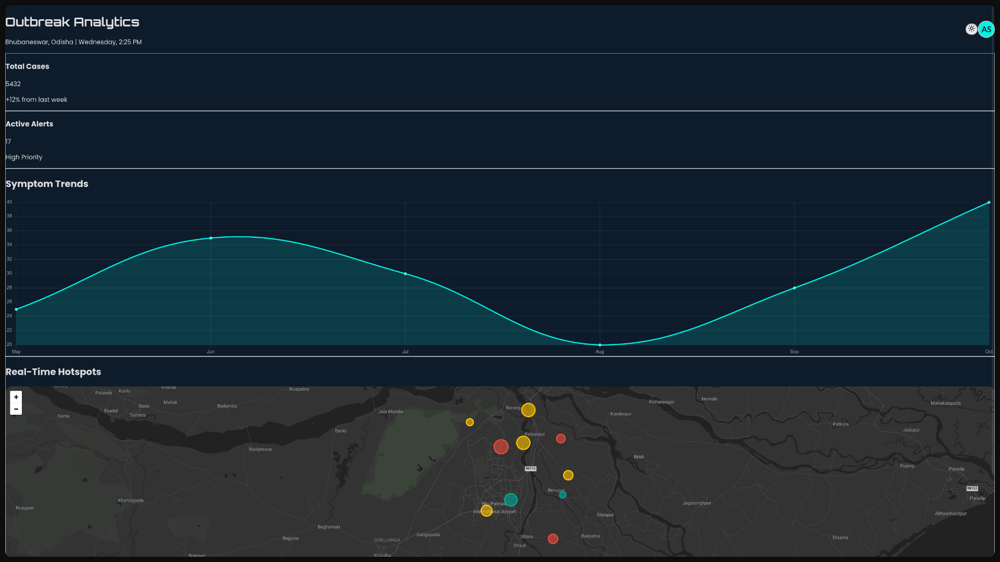

---

# HealNet | Health Surveillance Dashboard

HealNet is a full-stack web application designed to serve as a real-time health surveillance dashboard. It visualizes critical health data, including total cases, symptom trends, and geographical hotspots of outbreaks, to provide a clear and immediate overview of the public health situation in a given area.

The application features a responsive and modern user interface built with **React** and **Tailwind CSS**, powered by a high-performance **Rust** backend using the **Actix web** framework.



## Tech Stack

The project is divided into two main parts: a frontend client and a backend server.

### Frontend (`client` directory)

- **Framework**: **React** (with Vite)
- **Styling**: **Tailwind CSS**
- **Charting**: **Chart.js** with `react-chartjs-2`
- **Mapping**: **Leaflet** with `react-leaflet`
- **Icons**: **Lucide React**

### Backend (`server` directory)

- **Language**: **Rust**
- **Web Framework**: **Actix Web**
- **Key Crates**:
  - `actix-web` for the server and routing.
  - `serde` for data serialization/deserialization.
  - `rand` for generating mock data.
  - `actix-cors` for handling Cross-Origin Resource Sharing.

## Features

- **Real-Time Statistics**: Displays key metrics like total cases and active alerts.
- **Symptom Trend Analysis**: Visualizes disease case trends over time with an interactive line chart.
- **Geospatial Hotspot Mapping**: Plots outbreak hotspots on an interactive map, color-coded by disease type and sized by the number of cases.
- **Live Alert Feed**: Shows a list of recent critical, warning, and informational alerts.
- **Responsive Design**: A clean, modern UI that adapts to different screen sizes.
- **Asynchronous Data Loading**: A loading spinner provides a smooth user experience while data is fetched from the backend.

## Prerequisites

Before you begin, ensure you have the following installed on your system:

- **Rust and Cargo**: [https://www.rust-lang.org/tools/install](https://www.rust-lang.org/tools/install)
- **Node.js and npm**: [https://nodejs.org/](https://nodejs.org/)

## How to Run the Project

You can run this project in two modes: development mode for making changes, and production mode for a final build.

### 1\. Development Mode (with Hot Reloading)

This mode is ideal for development, as changes to the frontend code will be reflected instantly in the browser.

**Step 1: Start the Backend Server**

- Navigate to the `server` directory.

  ```sh
  cd server
  ```

- Run the server.

  ```sh
  cargo run
  ```

  The backend will start at `http://127.0.0.1:8080`.

**Step 2: Start the Frontend Client**

- Open a **new terminal** and navigate to the `client` directory.

  ```sh
  cd client
  ```

- Install the necessary npm packages.

  ```sh
  npm install
  ```

- Run the Vite development server.

  ```sh
  npm run dev
  ```

  The frontend will be accessible at `http://localhost:5173`. The Vite server will automatically proxy API requests to the Rust backend.

### 2\. Production Mode

This mode serves the optimized, static frontend files directly from the Rust server, simulating a real-world deployment.

**Step 1: Build the React Application**

- Navigate to the `client` directory.

  ```sh
  cd client
  ```

- Run the build script.

  ```sh
  npm run build
  ```

  This will create a `dist` folder containing the optimized production assets.

**Step 2: Run the Rust Server**

- Navigate to the `server` directory.

  ```sh
  cd server
  ```

- Run the server.

  ```sh
  cargo run
  ```

**Step 3: Access the Application**

- Open your browser and go to `http://127.0.0.1:8080`. The Rust server will now serve the complete application.

## Project Structure

```
/
├── client/         # Contains the React frontend application
│   ├── public/
│   ├── src/
│   │   ├── assets/
│   │   ├── components/ # Reusable React components
│   │   ├── App.jsx     # Main application component
│   │   └── main.jsx    # Entry point for the React app
│   ├── package.json
│   └── vite.config.js
│
└── server/         # Contains the Rust backend application
    ├── src/
    │   └── main.rs     # Main application logic and API endpoints
    └── Cargo.toml
```
